# DevSecOps Flask Pipeline (CI/CD with Security)

## Overview

This project demonstrates a **full DevSecOps CI/CD pipeline** built from scratch using a simple **Python Flask application**. The goal is to show how security is integrated **at every stage** of the software delivery lifecycle — from code commit to production deployment on Kubernetes.

This repository is intentionally built and troubleshot on **free-tier infrastructure** to reflect real-world constraints and common issues engineers face.

---

## Project Objectives

* Build a **realistic DevSecOps pipeline** using industry-standard tools
* Integrate **security scanning early (shift-left)** in CI
* Automatically **build, scan, and deploy** a containerized application
* Deploy to a **Kubernetes cluster (k3s on AWS EC2)**
* Gain hands-on experience troubleshooting **real production-like failures**

---

## Architecture (High Level)

```
Developer
   |
   v
GitHub Repository
   |
   v
GitHub Actions (CI)
   |  - Gitleaks (Secrets)
   |  - Semgrep (SAST)
   |  - Snyk (SCA)
   |  - Docker Build
   |  - Trivy (Container Scan)
   |  - Push to GHCR
   v
GitHub Container Registry (GHCR)
   |
   v
GitHub Actions (CD)
   |  - kubectl apply
   v
Kubernetes (k3s on AWS EC2)
   |
   v
Flask Application (NodePort Service)
```

---

## Tech Stack

### Application

* Python 3.12
* Flask
* Gunicorn

### CI/CD

* GitHub Actions
* Docker
* GitHub Container Registry (GHCR)

### Security (DevSecOps)

* **Gitleaks** – Secret scanning
* **Semgrep** – Static Application Security Testing (SAST)
* **Snyk** – Software Composition Analysis (SCA)
* **Trivy** – Container vulnerability scanning

### Infrastructure

* AWS EC2 (Free Tier)
* k3s (Lightweight Kubernetes)
* Kubernetes manifests (YAML)

---

## CI Pipeline (Security-First)

The CI pipeline runs on every push to `main` and on pull requests.

### CI Stages

1. **Checkout code**
2. **Secret scanning** (Gitleaks)
3. **SAST** (Semgrep)
4. **Dependency scanning** (Snyk)
5. **Docker image build**
6. **Container scanning** (Trivy)
7. **Push image to GHCR** (only if all scans pass)

### Key CI Principles

* Builds **fail fast** on security issues
* High/Critical vulnerabilities block the pipeline
* Image names are normalized to lowercase

---

## CD Pipeline (Kubernetes Deployment)

The CD pipeline triggers:

* Automatically after CI completes successfully
* Manually via `workflow_dispatch`

### CD Responsibilities

* Authenticate to Kubernetes using kubeconfig secret
* Create namespace if missing
* Deploy the latest image (by commit SHA)
* Expose the app via NodePort service
* Verify rollout success

---

## Kubernetes Configuration

### Namespace

```yaml
apiVersion: v1
kind: Namespace
metadata:
  name: demo
```

### Deployment (simplified)

```yaml
image: IMAGE_PLACEHOLDER
```

The image placeholder is dynamically replaced during CD.

### Service

* Type: NodePort
* Exposes Flask app externally

---

## How to Access the Application

```text
http://54.161.109.54:31445/
http://54.161.109.54:31445/health
```

---

## Troubleshooting & Lessons Learned (Highlights)

This project intentionally surfaced real-world issues:

* TLS certificate SAN mismatches in Kubernetes
* GHCR private image pull failures (ImagePullBackOff)
* GitHub Actions workflow triggers (`workflow_run` pitfalls)
* Resource starvation on small EC2 instances
* NodePort and Security Group misconfigurations

Each issue was documented and resolved as part of the learning process.

---

## Why This Project Matters

This is not a "hello world" pipeline.

It demonstrates:

* Practical DevSecOps skills
* Security tooling integration
* Kubernetes troubleshooting
* Cloud networking fundamentals
* CI/CD workflow design

---

## Future Improvements

* Add Ingress (Traefik / NGINX)
* Use Elastic IP for stable control plane
* Add Helm charts
* Introduce DAST (OWASP ZAP)
* Add monitoring (Prometheus/Grafana)

---

## Final Note

This project reflects **real DevSecOps engineering**, including mistakes, fixes, and hard-earned lessons.

If it didn’t break — you didn’t learn.

```mermaid
flowchart LR
    Dev([Developer]) --> Repo[(GitHub Repo)]

    Repo --> CI{CI Pipeline}

    CI --> S1["🔐 Gitleaks<br/>(Secrets)"]
    S1 --> S2["📋 Semgrep<br/>(SAST)"]
    S2 --> S3["📦 Snyk<br/>(Dependencies)"]
    S3 --> S4["🐳 Docker Build"]
    S4 --> S5["🔍 Trivy<br/>(Container)"]

    S5 -->|PASS| GHCR[(GHCR)]
    S5 -->|FAIL| Stop["❌ Stop"]

    GHCR --> CD{CD Pipeline}
    CD --> Deploy["kubectl apply"]

    Deploy --> K8s["Kubernetes<br/>k3s / AWS"]
    K8s --> Pod["Flask Pod"]
    Pod --> Service["NodePort<br/>Service"]
    Service --> User([Browser])
    
    style Dev fill:#90EE90,color:#000
    style Repo fill:#87CEEB,color:#000
    style CI fill:#FFD700,color:#000
    style CD fill:#FFD700,color:#000
    style GHCR fill:#87CEEB,color:#000
    style K8s fill:#FF6347,color:#fff
    style Pod fill:#DDA0DD,color:#000
    style Service fill:#DDA0DD,color:#000
    style User fill:#90EE90,color:#000
    style StopCI fill:#FF4444,color:#fff
```



